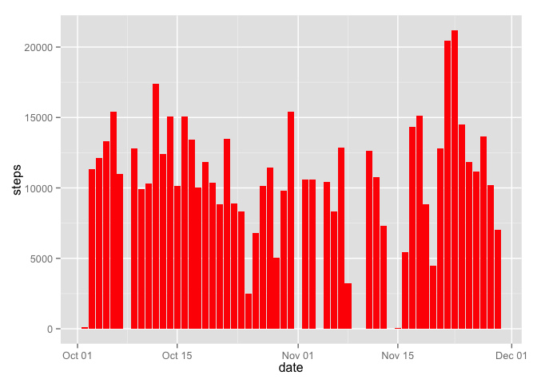
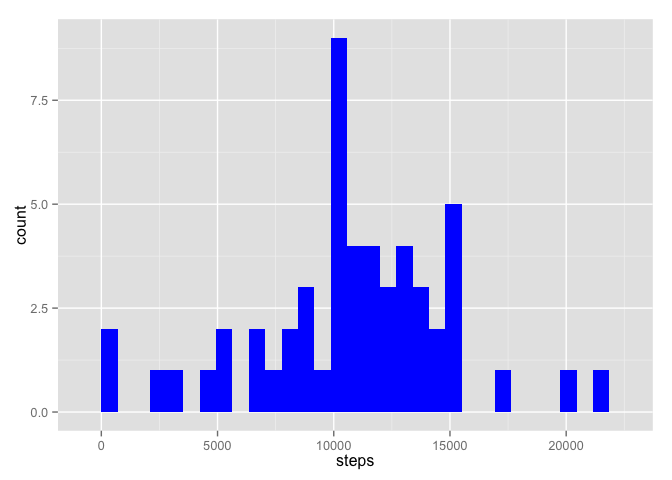
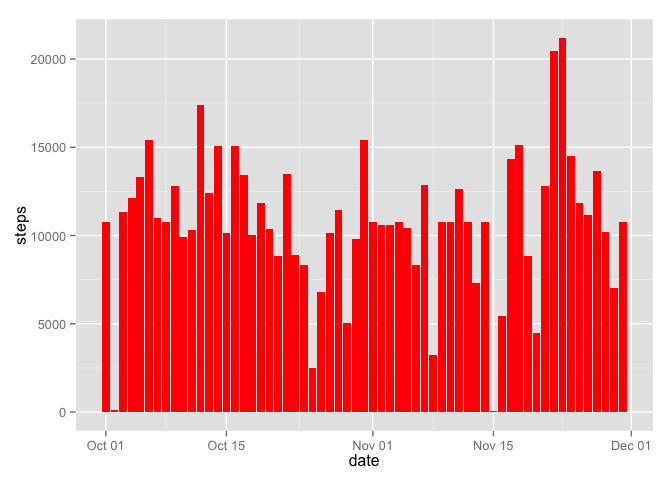
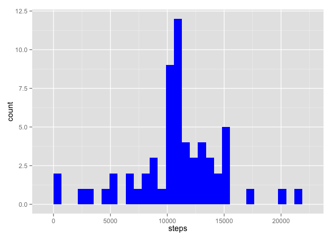

# Reproducible Research: Peer Assessment 1


## Loading and preprocessing the data

```r
# load data
data <- read.csv(unz("activity.zip", "activity.csv"), colClasses=c("numeric", "Date", "numeric"))
dim(data)
```

```
## [1] 17568     3
```

```r
head(data)
```

```
##   steps       date interval
## 1    NA 2012-10-01        0
## 2    NA 2012-10-01        5
## 3    NA 2012-10-01       10
## 4    NA 2012-10-01       15
## 5    NA 2012-10-01       20
## 6    NA 2012-10-01       25
```


## What is mean total number of steps taken per day?

### Sum steps for each day

```r
library(dplyr)
total_steps_per_day <- data %>% group_by(date) %>% summarise(steps=sum(steps))
```

### It is possible to draw two kinds of histograms

#### draw a histogram of the total number of steps taken each day

```r
library(ggplot2)
g <- ggplot(total_steps_per_day, aes(x=date, y=steps)) 
g + geom_histogram(stat="identity", fill="red")
```

 

#### draw a histogram of the total number of steps 

```r
g <- ggplot(total_steps_per_day, aes(x=steps)) 
g + geom_histogram(stat="bin", fill = "blue")
```

 

### calculate mean and median number of steps per day

```r
original_mean <- mean(total_steps_per_day$steps, na.rm = TRUE)
original_mean
```

```
## [1] 10766.19
```

```r
# calculate median
original_median <- median(total_steps_per_day$steps, na.rm = TRUE)
original_median
```

```
## [1] 10765
```

```r
# we can look at summary
summary(total_steps_per_day)
```

```
##       date                steps      
##  Min.   :2012-10-01   Min.   :   41  
##  1st Qu.:2012-10-16   1st Qu.: 8841  
##  Median :2012-10-31   Median :10765  
##  Mean   :2012-10-31   Mean   :10766  
##  3rd Qu.:2012-11-15   3rd Qu.:13294  
##  Max.   :2012-11-30   Max.   :21194  
##                       NA's   :8
```

## What is the average daily activity pattern?

### The graph below is a time series of the avg. steps per 5 min interval across all days

```r
daily_activity_pattern <- data %>% group_by(interval) %>% summarise(steps=mean(steps, na.rm=TRUE))
plot(daily_activity_pattern, type="l", main="Average Daily Activity Pattern", xlab="5-minute interval", ylab="Average number of steps taken across all days")
```

 

### Which 5-minute interval across all days contains the maximum number of steps


```r
daily_activity_pattern[which.max(daily_activity_pattern$steps), "interval"]
```

```
## Source: local data frame [1 x 1]
## 
##   interval
## 1      835
```

```r
daily_activity_pattern[which.max(daily_activity_pattern$steps), "steps"]
```

```
## Source: local data frame [1 x 1]
## 
##      steps
## 1 206.1698
```

## Imputing missing values

### Calculate the total number of missing values in the dataset

```r
sum(is.na(data$steps))
```

```
## [1] 2304
```

### Imputing missing values strategy 
In order to impute those missing values, one of the strategies is to replace them with the mean of the 5-min interval across all days

### Fill in missing values

```r
newdata <- data
newdata$steps[is.na(newdata$steps)] <-  daily_activity_pattern[daily_activity_pattern$interval == newdata$interval[is.na(newdata$steps)]]$steps
```

### Make a histogram of the new data

#### It is possible to draw two kinds of histograms

##### draw a histogram of the total number of steps taken each day

```r
new_total_steps_per_day <- newdata %>% group_by(date) %>% summarise(steps=sum(steps))
library(ggplot2)
g <- ggplot(new_total_steps_per_day, aes(x=date, y=steps)) 
g + geom_histogram(stat="identity", fill="red")
```

 

##### draw a histogram of the total number of steps 

```r
g <- ggplot(new_total_steps_per_day, aes(x=steps)) 
g + geom_histogram(stat="bin", fill = "blue")
```

 

#### calculate mean and median number of steps per day

```r
new_mean <- mean(new_total_steps_per_day$steps, na.rm = TRUE)
new_mean
```

```
## [1] 10766.19
```

```r
# calculate median
new_median <- median(new_total_steps_per_day$steps, na.rm = TRUE)
new_median
```

```
## [1] 10766.19
```

```r
# we can look at summary
summary(new_total_steps_per_day)
```

```
##       date                steps      
##  Min.   :2012-10-01   Min.   :   41  
##  1st Qu.:2012-10-16   1st Qu.: 9819  
##  Median :2012-10-31   Median :10766  
##  Mean   :2012-10-31   Mean   :10766  
##  3rd Qu.:2012-11-15   3rd Qu.:12811  
##  Max.   :2012-11-30   Max.   :21194
```

### Conclusion
As we can see the results made from new data have the same mean 1.0766189\times 10^{4} and median 1.0766189\times 10^{4}
New median is slightly different from original median. The difference is 1.1886792
The new mean and original mean are the same.

## Are there differences in activity patterns between weekdays and weekends?
For this part the weekdays() function may be of some help here. Use the dataset with the filled-in missing values for this part.

Create a new factor variable in the dataset with two levels – “weekday” and “weekend” indicating whether a given date is a weekday or weekend day.

Make a panel plot containing a time series plot (i.e. type = "l") of the 5-minute interval (x-axis) and the average number of steps taken, averaged across all weekday days or weekend days (y-axis). The plot should look something like the following, which was creating using simulated data:

### Create dayType from new data

```r
library(lattice)
newdata$day <- weekdays(newdata$date)
newdata$dayType[newdata$day=="Sunday"]<-"weekend"
newdata$dayType[newdata$day=="Saturday"]<-"weekend"
newdata$dayType[is.na(newdata$dayType)]<-"weekday"
newdata$dayType<-as.factor(newdata$dayType)
```
### Group by interval and dayType

```r
library(ggplot2)
new_daily_activity_pattern <- newdata %>% group_by(interval, dayType) %>% summarise(steps=mean(steps))
with(new_daily_activity_pattern, xyplot(steps~interval|dayType, layout=c(1,2), type="l", xlab="Interval", ylab="Number of steps"))
```

 
